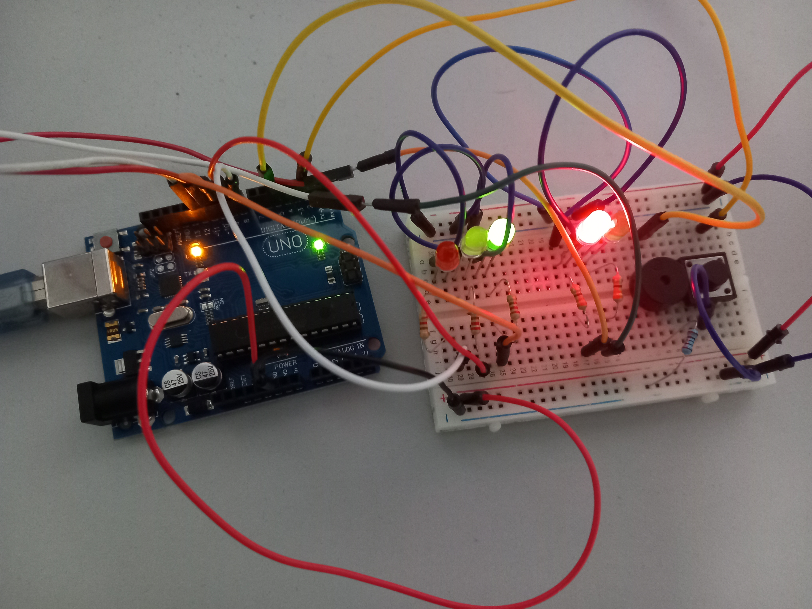

# Traffic Lights
* Components: 5 LEDs, 1 button, 1 buzzer, resistors and wires (per logic)
* General description: Building the traffic lights for a crosswalk. I
will use 2 LEDs to represent the traffic lights for people (red and green)
and 3 LEDs to represent the traffic lights for cars (red, yellow and green).
* The system has the following states:
  1. State 1 (default, reinstated after state 4 ends): green light for cars,
red light for people, no sounds. Duration: indefinite, changed by
pressing the button.
  2. State 2 (initiated by counting down 8 seconds after a button press):
the light should be yellow for cars, red for people and no sounds.
Duration: 3 seconds.
  3. State 3 (initiated after state 2 ends): red for cars, green for people
and a beeping sound from the buzzer at a constant interval. Duration:
8 seconds.
  4. State 4 (initiated after state 3 ends): red for cars, blinking green
for people and a beeping sound from the buzzer, at a constant interval, faster than the beeping in state 3. This state should last 4
seconds.

* [Video](https://www.youtube.com/watch?v=8owWVevKAU0)

