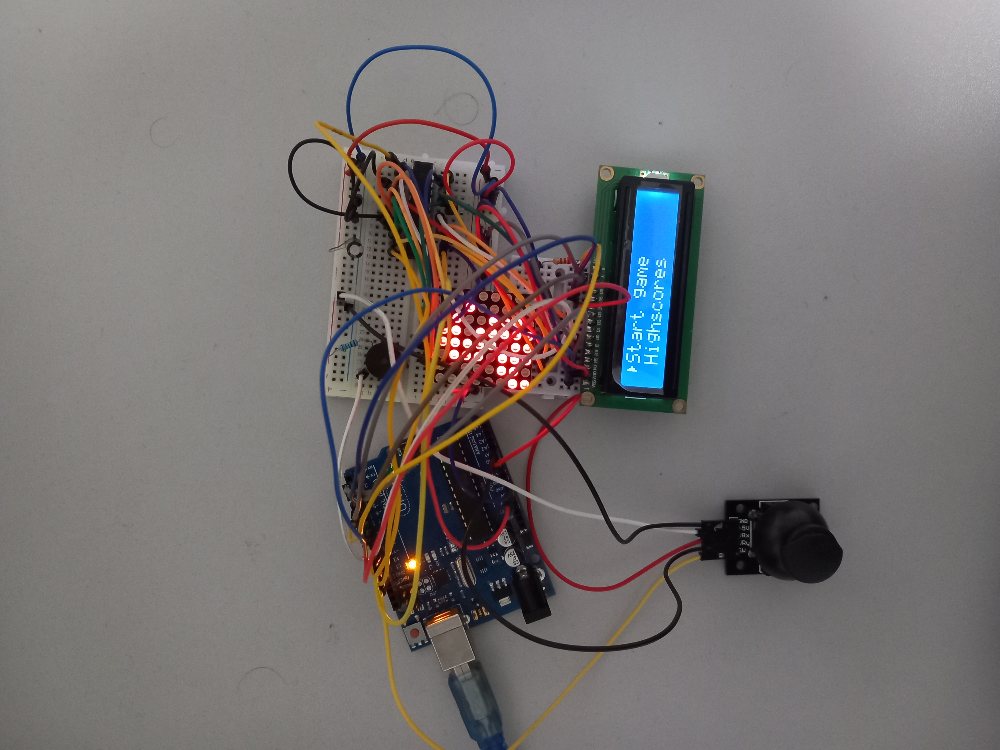

# Matrix Project (Snake)

* Components: 1 LCD, 1 joystick, 1 buzzer, 1 led matrix, 3 rezistors, 1 10µF electrolytic, 1 0.1 µF ceramic capacitor, 1 MAX7219, 1 Arduino UNO Board
* About game: Move the snake using the joystick to eat food, grow and increase your score, while avoiding hitting the walls or yourself. The speed of the game will increase periodically.
* States:
  1. Menu (Navigate using joystick):
      - Start game
      - Highscores
      - Settings:
        - Enter Name
        - Difficulty
        - LCD contrast
        - LCD brightness
        - Matrix settings
        - Sounds
      - About
      - How to play
  2. Game
  3. Game over screens

* [Video](https://www.youtube.com/watch?v=rTzllapS3T0)

